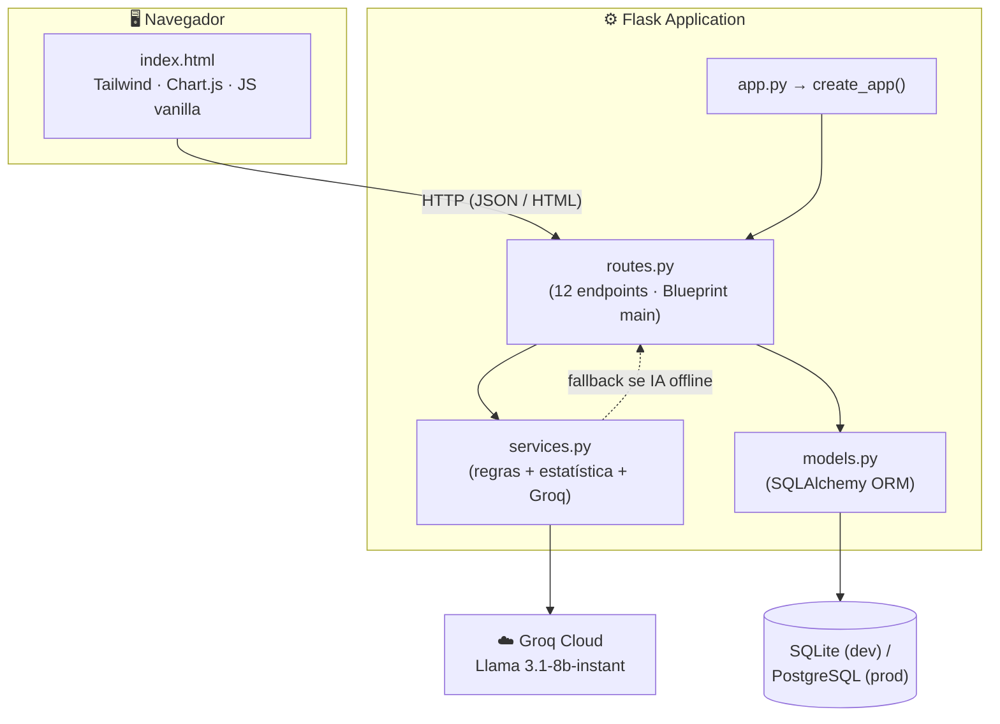
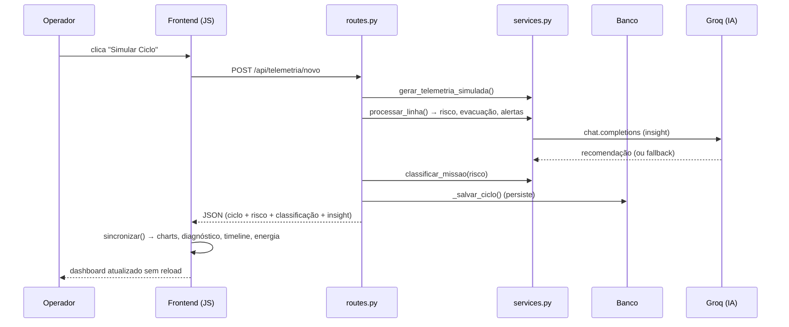
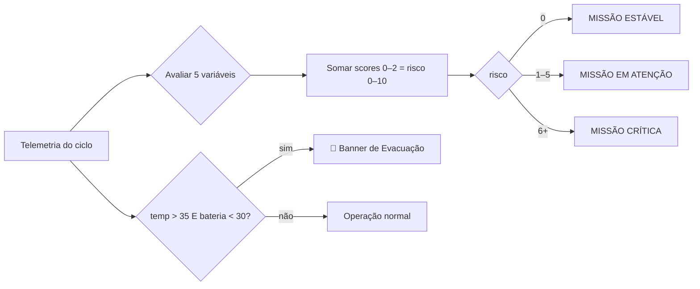

Mission Control AI

Central inteligente de monitoramento de missão espacial experimental

Telemetria em tempo real • Análise de risco • Gestão energética • IA generativa (NEXUS-7)

FIAP · Global Solution 2026.1
Deploy Railway

🚀 Acesse o projeto

Abrir Mission Control AI

https://missioncontrolai.up.railway.app/
## Integrantes

* Thiago de Oliveira Coelho Souza — RM: 568783
* Sammy de Moura Sato — RM: 569182
* João Pedro Pereira Teixeira — RM: 569937

---

## Sumário

Disciplinas: [PIA — Prompt & AI](#pia) · [SERS — Energias Renováveis](#sers) · [DSA — Data Structures & Algorithms](#dsa) · [PCP — Pensamento Computacional](#pcp)

Seções: [Visão Geral](#visão-geral-do-projeto) · [Arquitetura](#arquitetura-da-solução) · [Tecnologias](#tecnologias-utilizadas) · [Funcionalidades](#funcionalidades-implementadas) · [Demonstração](#demonstração-do-sistema) · [Banco de Dados](#banco-de-dados) · [Regras de Negócio](#regras-de-negócio) · [Integração com IA](#integração-com-inteligência-artificial) · [Como Executar](#como-executar) · [Evidências](#evidências-para-avaliação)

---

## Visão Geral do Projeto

Missões espaciais dependem de sistemas de solo (*ground segment*) que monitoram continuamente as condições da nave para garantir a segurança da tripulação e o sucesso operacional. Quando uma variável sai da faixa ideal — ou pior, quando **várias falham ao mesmo tempo** — a equipe de controle precisa entender **rapidamente** o que está acontecendo, por quê, e o que exige ação imediata.

O **Mission Control AI** resolve esse problema simulando o controle operacional da missão **Orion Test Alpha** (operada pela **Equipe Apollo**). O sistema:

- **Recebe e simula** ciclos de telemetria com 5 variáveis operacionais (temperatura, comunicação, bateria solar, consumo de O₂ e estabilidade da matriz energética);
- **Avalia automaticamente** cada variável (NORMAL / ATENÇÃO / CRÍTICO), calcula uma **pontuação de risco** por ciclo (0–10) e **classifica a missão** (ESTÁVEL / EM ATENÇÃO / CRÍTICA);
- **Detecta anomalias** isoladas (outliers), problemas correlacionados, degradação e recuperação ao longo da série;
- **Gerencia energia** (potência, corrente, balanço consumido × gerado, eficiência) com foco em sustentabilidade;
- **Integra IA generativa** (Groq / Llama 3.1) para recomendações por ciclo, uma narrativa de missão e um **chat com memória** entre o operador humano e o copiloto **NEXUS-7**.

**Objetivos:** transformar dados brutos de sensores em **decisão operacional**, reduzir o tempo de interpretação do operador, e demonstrar uma plataforma de monitoramento que une **lógica determinística** (regras de negócio auditáveis) com **inteligência artificial** (contexto e linguagem natural).

**Papel da IA:** a IA não substitui as regras — ela as **complementa**. As decisões de risco/alerta são 100% determinísticas e explicáveis; a IA gera a camada de **interpretação e recomendação** em linguagem natural, sempre com *fallback* de contingência caso a API esteja indisponível.

**Benefícios operacionais:** leitura instantânea do estado da missão (HUD + classificação + justificativa), priorização visual de ciclos relevantes, diagnóstico por variável com impacto e recomendação, e um relatório técnico exportável.

---

## Arquitetura da Solução

A aplicação segue uma arquitetura **modular em camadas** com *Application Factory* (Flask), separação estrita de responsabilidades e *Server-Side Rendering* + *progressive enhancement* no frontend.

| Camada | Componente | Responsabilidade |
|--------|-----------|------------------|
| Entry point | `app.py` | Cria a app (`create_app`) e lê `PORT` |
| Factory / Config | `src/__init__.py` | Inicializa Flask + SQLAlchemy, resolve o banco por `DATABASE_URL`, executa migração idempotente |
| Rotas (HTTP) | `src/routes.py` | I/O HTTP, serialização e persistência (Blueprint `main`, 12 rotas) |
| Serviços (lógica) | `src/services.py` | Regras de negócio, estatística, geração e **toda** a comunicação com a Groq |
| Modelos (ORM) | `src/models.py` | `CicloTelemetria`, `MensagemChat` |
| Banco | SQLite (dev) / PostgreSQL (prod) | Persistência via SQLAlchemy |
| IA | Groq Cloud · Llama 3.1-8b-instant | Insights, narrativa e chat |
| Frontend | `templates/index.html` | SSR (Jinja2) + JS vanilla + Tailwind + Chart.js |

### Diagrama de componentes



### Fluxo cliente-servidor (gerar um ciclo)



---

## Tecnologias Utilizadas

| Tecnologia | Versão | Função no projeto |
|-----------|--------|-------------------|
| **Python** | 3.11 | Linguagem do backend e da versão terminal (DSA) |
| **Flask** | 3.1.3 | Framework web (rotas, SSR, Blueprint, factory) |
| **Flask-SQLAlchemy** | 3.1.1 | Integração ORM com o Flask |
| **SQLAlchemy** | 2.0.50 | ORM / camada de acesso a dados |
| **SQLite** | nativo | Banco de desenvolvimento (zero-config) |
| **PostgreSQL** | (Railway) | Banco de produção via `DATABASE_URL` |
| **Groq API** | groq 1.4.0 | Provedor de inferência de IA (baixa latência) |
| **Llama 3.1-8b-instant** | — | Modelo de linguagem (insights, narrativa, chat) |
| **HTML5** | — | Estrutura semântica do dashboard |
| **Tailwind CSS** | CDN | Estilização utilitária (tema "console de missão") |
| **JavaScript (vanilla)** | ES2020+ | Interatividade, *fetch*, atualização dinâmica |
| **Chart.js** | 4.4.0 | 5 gráficos (telemetria, risco, área, energia, potência) |
| **Marked.js** | 9.1.6 | Renderização Markdown nas respostas da IA |
| **Gunicorn** | 21.2.0 | Servidor WSGI de produção |
| **psycopg2-binary** | 2.9.9 | Driver PostgreSQL |

---

## Funcionalidades Implementadas

### 1. Simulação automática de ciclos
**Objetivo:** gerar telemetria realista sem entrada manual.
**Como funciona:** `gerar_telemetria_simulada()` sorteia as 5 variáveis em faixas plausíveis; o ciclo é processado, classificado e persistido. No frontend, o botão "Simular Ciclo" chama `POST /api/telemetria/novo` e atualiza o dashboard sem reload.

### 2. Gerador de missão parametrizável
**Objetivo:** simular cenários completos e reprodutíveis.
**Como funciona:** `gerar_dados_missao(n_ciclos, perfil, seed, eventos)` gera de 6 a 20 ciclos seguindo um **perfil** (estável, degradação, recuperação, caótica), com **seed** reprodutível, ruído suave (AR(1)), **correlação física** (calor derruba estabilidade/bateria) e **eventos pontuais** (pico térmico, falha de comunicação etc.). Endpoint: `POST /api/simulacao/gerar`.

### 3. Inserção manual de telemetria
**Objetivo:** testar valores específicos.
**Como funciona:** 5 sliders/inputs sincronizados enviam `POST /api/telemetria/manual`; o servidor **valida e limita** os valores (`_num()`), evitando entradas absurdas.

### 4. Dashboard operacional
**Objetivo:** leitura instantânea do estado da missão.
**Como funciona:** HUD de vitais (relógio MET, ciclos, risco médio, status, balanço energético), sumário com classificação + justificativa, médias, gráficos, diagnóstico, timeline, estatística e chat — tudo numa única página com navegação por *scroll-spy*.

### 5. Cálculo de risco (PCP/DSA)
**Objetivo:** quantificar o estado do ciclo.
**Como funciona:** cada variável recebe um *score* 0/1/2 (NORMAL/ATENÇÃO/CRÍTICO); a soma (0–10) é o risco do ciclo (`calcular_risco`).

### 6. Classificação da missão + justificativa
**Objetivo:** rótulo operacional auditável.
**Como funciona:** `classificar_missao(risco)` → **0 = ESTÁVEL · 1–5 = EM ATENÇÃO · 6+ = CRÍTICA**, persistido no banco (coluna `classificacao`); `justificar_classificacao()` explica o porquê (quais parâmetros críticos/atenção).

### 7. Geração automática de alertas
**Objetivo:** comunicar condições por variável.
**Como funciona:** cada `analisar_*` retorna uma mensagem; o frontend pinta o indicador por severidade (verde/âmbar/vermelho).

### 8. Detecção de anomalias e leitura inteligente
**Objetivo:** interpretar comportamento, não só números.
**Como funciona:** `tipo_evento_serie()` classifica cada ciclo em **Estável / Atenção / Crítico / Recuperação / Outlier / Correlacionado** (outliers via desvio > 2σ; correlacionado = 2+ críticos no mesmo ciclo; recuperação = saída de estado crítico). `gerar_alertas_avancados()` produz alertas analíticos da série (TENDÊNCIA NEGATIVA, RECUPERAÇÃO, ANOMALIA ENERGÉTICA etc.).

### 9. Detecção de anomalia crítica (evacuação)
**Objetivo:** alerta de emergência combinada.
**Como funciona:** `detectar_evacuacao(temp, bat)` → `temp > 35 AND bateria < 30`. Aciona o banner vermelho fixo, refletindo **apenas o ciclo mais recente**.

### 10. Diagnóstico operacional por variável
**Objetivo:** explicar valor, status, faixa ideal, impacto e ação.
**Como funciona:** `diagnostico_variaveis()` retorna, por variável, um cartão completo. Endpoint `GET /api/diagnostico`.

### 11. Subsistema energético (SERS)
**Objetivo:** gestão de energia e sustentabilidade.
**Como funciona:** `calcular_metricas_energeticas()` calcula potência (P=V·I), corrente, energia consumida, geração fotovoltaica simulada, **balanço** e **eficiência**; `resumo_energetico()` agrega e recomenda. Endpoint `GET /api/energetico`.

### 12. Timeline interativa
**Objetivo:** navegar o histórico com foco no relevante.
**Como funciona:** cards clicáveis (ciclo, pontuação, classificação, nº de anomalias, tipo de evento) → **modal** de detalhe; por padrão mostra **só ciclos relevantes** + botão "Ver todos"; **filtros** por tipo sem refresh.

### 13. Gráficos em tempo real
**Objetivo:** visualização multivariável.
**Como funciona:** 5 gráficos Chart.js (telemetria de 5 parâmetros, risco por ciclo colorido por classificação, pizza de pontuação por área, energia consumida × gerada, potência × corrente), atualizados por `sincronizar()`.

### 14. Chat com IA (memória persistente)
**Objetivo:** consulta técnica em linguagem natural.
**Como funciona:** `POST /api/chat` carrega todo o histórico do banco, envia ao Groq e persiste pergunta + resposta. Renderização Markdown via Marked.js.

### 15. Insight proativo (copiloto NEXUS-7)
**Objetivo:** recomendação automática do estado atual.
**Como funciona:** widget flutuante sugere uma pergunta/ação com base no último ciclo e pode encaminhá-la ao chat.

### 16. Estatística descritiva (Modelagem)
**Objetivo:** análise quantitativa da série.
**Como funciona:** `GET /api/estatisticas` calcula média, mediana, mín/máx, amplitude, variância, desvio padrão, coeficiente de variação e quartis (Q1/Q3) por variável — em Python puro.

### 17. Relatório técnico exportável
**Objetivo:** evidência documental da missão.
**Como funciona:** `GET /api/relatorio` gera um `.txt` completo (por ciclo + relatório final + **conclusão dinâmica** baseada na tendência/recuperação/degradação).

### 18. Versão terminal (DSA)
**Objetivo:** monitoramento em Python puro, sem dependências.
**Como funciona:** `mission_control.py` percorre a matriz `dados_missao`, analisa, classifica, calcula energia e imprime relatório colorido no terminal.

---

## Demonstração do Sistema

> As imagens devem ser salvas em `assets/` e referenciadas abaixo.

### Print 1 — Dashboard Operacional Completo
`[INSERIR IMAGEM AQUI]` *(assets/dashboard.png)*
Descrição: dashboard principal com HUD de vitais, sumário (classificação + justificativa) e navegação.

### Print 2 — Simulação Automática de Telemetria
`[INSERIR IMAGEM AQUI]` *(assets/simulacao.png)*
Descrição: geração automática de um novo ciclo e atualização do dashboard sem reload.

### Print 3 — Inserção Manual de Telemetria
`[INSERIR IMAGEM AQUI]` *(assets/manual.png)*
Descrição: formulário com sliders para injeção manual de dados da missão.

### Print 4 — Gráficos em Tempo Real
`[INSERIR IMAGEM AQUI]` *(assets/graficos.png)*
Descrição: atualização dinâmica dos 5 gráficos Chart.js após novos ciclos.

### Print 5 — Alerta Crítico de Emergência
`[INSERIR IMAGEM AQUI]` *(assets/evacuacao.png)*
Descrição: banner de evacuação após detecção da anomalia crítica (temp > 35 e bateria < 30).

### Print 6 — Chat com IA
`[INSERIR IMAGEM AQUI]` *(assets/chat.png)*
Descrição: interação entre operador e copiloto NEXUS-7, com resposta em Markdown.

### Print 7 — Insight Proativo da IA
`[INSERIR IMAGEM AQUI]` *(assets/copiloto.png)*
Descrição: widget flutuante com recomendação automática baseada no último ciclo.

### Print 8 — Diagnóstico Operacional
`[INSERIR IMAGEM AQUI]` *(assets/diagnostico.png)*
Descrição: cards por variável com status, faixa ideal, impacto e recomendação.

### Print 9 — Timeline + Modal de Detalhe
`[INSERIR IMAGEM AQUI]` *(assets/timeline.png)*
Descrição: cards clicáveis com filtros e modal de detalhe do ciclo.

### Print 10 — Subsistema Energético (SERS)
`[INSERIR IMAGEM AQUI]` *(assets/energia.png)*
Descrição: indicadores e gráficos de consumo × geração + recomendação energética.

### Print 11 — Versão Terminal (DSA)
`[INSERIR IMAGEM AQUI]` *(assets/terminal.png)*
Descrição: `python mission_control.py` exibindo a análise e o relatório no terminal.

---

## Estrutura de Pastas

```text
Mission-Control-AI/
├── app.py                  # Entry point (cria a app, lê PORT)
├── mission_control.py      # Versão terminal — disciplina DSA (Python puro)
├── Procfile                # web: gunicorn app:app (deploy)
├── requirements.txt        # Dependências fixadas (pinned)
├── .python-version         # 3.11 (builder do Railway)
├── .env.example            # Modelo de variáveis de ambiente
├── .gitignore              # Segredos, *.db, venv, .claude, logs...
├── README.md               # Este arquivo
├── missao.db               # SQLite gerado em runtime (ignorado no git)
├── src/                    # Pacote Python principal
│   ├── __init__.py         #   App factory + DB por env + migração idempotente
│   ├── models.py           #   Modelos ORM (CicloTelemetria, MensagemChat)
│   ├── routes.py           #   Blueprint "main" (12 endpoints)
│   └── services.py         #   Regras de negócio, estatística e integração Groq
├── templates/
│   └── index.html          # Dashboard (SSR Jinja2 + JS vanilla + Chart.js)
├── assets/                 # Prints do README
└── docs/                   # Documentação técnica (arquitetura, decisões, deploy...)
```

| Diretório / arquivo | Responsabilidade |
|---------------------|------------------|
| `app.py` | Ponto de entrada WSGI (`app = create_app()`) |
| `mission_control.py` | Programa de terminal (DSA) — independente do web |
| `src/` | Backend modular (factory, modelos, rotas, serviços) |
| `templates/` | Frontend SSR + JS (template único) |
| `assets/` | Capturas de tela para documentação |
| `docs/` | ARCHITECTURE, DECISIONS, DEPLOY, TASKS, PROJECT_STATE, etc. |

---

## Banco de Dados

Dois modelos ORM (SQLAlchemy). Em produção o mesmo schema roda em PostgreSQL; a coluna `classificacao` é adicionada por **migração idempotente** (`_migrate()`), preservando bancos existentes.

### `CicloTelemetria`

| Campo | Tipo | Finalidade |
|-------|------|------------|
| `id` | Integer (PK) | Identificador único auto-incremento |
| `ciclo` | Integer | Número sequencial do ciclo (via `MAX(ciclo)+1`) |
| `temperatura` | Float | Temperatura interna (°C) |
| `comunicacao` | Float | Qualidade do sinal de comunicação (%) |
| `bateria_solar` | Float | Carga da bateria solar (%) |
| `consumo_o2` | Float | Consumo de oxigênio (L/min) |
| `matriz` | Float | Estabilidade da matriz energética (%) |
| `risco` | Integer | Pontuação de risco do ciclo (0–10) |
| `classificacao` | String(20) | MISSÃO ESTÁVEL / EM ATENÇÃO / CRÍTICA |
| `alerta_evacuacao` | Boolean | `True` se `temp > 35 AND bateria < 30` |
| `ia_insight` | Text | Recomendação gerada pela IA (sem truncamento) |
| `timestamp` | DateTime | Data/hora de criação (UTC) |

> Observação de nomenclatura: o campo de comunicação chama-se `comunicacao` (não `sinal_comunicacao`) e o de estabilidade `matriz` (não `matriz_energia`).

### `MensagemChat`

| Campo | Tipo | Finalidade |
|-------|------|------------|
| `id` | Integer (PK) | Identificador único auto-incremento |
| `role` | String(10) | Remetente: `"user"` ou `"assistant"` |
| `content` | Text | Conteúdo da mensagem |
| `timestamp` | DateTime | Data/hora da mensagem (UTC) |

---

## Regras de Negócio

### Avaliação por variável (cada uma retorna `score` 0/1/2)

| Variável | NORMAL (0) | ATENÇÃO (1) | CRÍTICO (2) |
|----------|-----------|-------------|-------------|
| Temperatura (°C) | ≤ 30 | 31–38 | > 38 |
| Comunicação (%) | ≥ 70 | 40–69 | < 40 |
| Bateria solar (%) | ≥ 60 | 25–59 | < 25 |
| Consumo O₂ (L/min) | ≤ 9 | 9,1–11 | > 11 |
| Estabilidade matriz (%) | ≥ 80 | 50–79 | < 50 |

Trecho real (`src/services.py`):

```python
def analisar_temperatura(v):
    if v <= 30: return 0, "Temperatura nominal."
    if v <= 38: return 1, "Aquecimento moderado detectado. Monitorar resfriamento."
    return 2, "Superaquecimento crítico! Risco de colapso de hardware."

def analisar_energia(v):
    if v >= 60: return 0, "Bateria carregada via painéis solares."
    if v >= 25: return 1, "Subprodução fotovoltaica. Restringir sistemas secundários."
    return 2, "Dreno crítico! Ativar células de combustível de hidrogênio."
```

### Cálculo de risco e classificação

```python
def calcular_risco(linha):
    return sum(ANALISADORES[i](linha[i])[0] for i in range(5))   # 0–10

def classificar_missao(risco):
    if risco == 0:  return "MISSÃO ESTÁVEL"
    if risco <= 5:  return "MISSÃO EM ATENÇÃO"
    return "MISSÃO CRÍTICA"
```

### Fluxo de decisão do ciclo



### Regra de evacuação iminente

```python
def detectar_evacuacao(temp, bateria):
    return temp > 35 and bateria < 30
```

### Respostas automatizadas (frontend)
- `alerta_evacuacao` ou `risco ≥ 8` → toast vermelho (erro);
- `risco ≥ 5` → toast âmbar (atenção);
- `risco < 5` → sem toast (o status do botão já confirma).

---

## Integração com Inteligência Artificial

- **Modelo:** Llama 3.1-8b-instant, servido pela **Groq Cloud** (baixa latência).
- **Onde:** toda chamada à IA passa **exclusivamente** por `src/services.py` (a camada de rotas nunca importa `groq`).
- **Resiliência:** toda chamada tem `try/except` com *fallback* de contingência — o sistema nunca quebra por falha da API.
- **Tamanho da resposta:** controlado **apenas pelo system prompt** (sem `max_tokens`), garantindo respostas completas, salvas integralmente.

### System prompt contextualizado (insight por ciclo)

```python
def obter_insight_ia(ciclo_idx, valores, risco):
    try:
        resp = groq_client.chat.completions.create(
            messages=[
                {"role": "system", "content": "Atue como engenheiro de sistemas espaciais da Nasa. Forneça uma única recomendação direta (max 40 palavras) em português focada em eficiência energética, painéis solares ou baterias."},
                {"role": "user", "content": f"Ciclo {ciclo_idx} | Temp={valores[0]}°C, Sinal={valores[1]}%, Bateria Solar={valores[2]}%, O2={valores[3]}L/min, Matriz={valores[4]}% | Risco: {risco}/10."},
            ],
            model="llama-3.1-8b-instant", temperature=0.1,
        )
        return resp.choices[0].message.content.strip()
    except Exception as e:
        return f"Modo de Contingência: Analisar padrão do Módulo Fotovoltaico. Erro: {str(e)}"
```

### Chat com memória persistente

```python
def obter_resposta_chat(historico, pergunta):
    msgs = [{"role": "system", "content": "Você é um assistente de engenharia aeroespacial. Responda em português, de forma técnica, completa e bem estruturada..."}]
    for m in historico:                       # histórico vindo do banco
        msgs.append({"role": m.role, "content": m.content})
    msgs.append({"role": "user", "content": pergunta})
    # ... chamada Groq com fallback ...
```

**Como a memória é preservada:** cada turno (`role`/`content`) é gravado na tabela `MensagemChat`; a cada nova pergunta o histórico completo é recarregado e reenviado ao modelo, reconstruindo o contexto.

**Copiloto NEXUS-7:** `gerar_sugestao_copiloto()` (backend) e `gerarSugestao()` (frontend) avaliam o último ciclo por prioridade de risco e sugerem uma pergunta acionável.

**Narrativa da missão:** ao gerar uma simulação em lote, `gerar_narrativa_missao()` faz **uma única** chamada à IA com a visão geral da missão (evita custo por ciclo).

**Exemplo (entrada → saída):**
- *Entrada (insight):* `Ciclo 5 | Temp=39°C, Sinal=28%, Bateria Solar=19%, O2=11.5L/min, Matriz=35% | Risco: 10/10.`
- *Saída típica:* *"Risco crítico combinado: reduza cargas não essenciais, redirecione os painéis para recarga prioritária da bateria e acione o resfriamento de emergência antes do colapso térmico."*

---

# Aplicação nas Disciplinas

<a id="pia"></a>
## Disciplina — Prompt and Artificial Intelligence

**Como o projeto atende:** IA generativa integrada de ponta a ponta com engenharia de prompt explícita.

- **IA generativa + modelo de linguagem:** Llama 3.1-8b-instant via Groq, em 3 frentes — insight por ciclo, narrativa de missão e chat.
- **Prompt engineering / system prompts:** papéis bem definidos ("engenheiro de sistemas espaciais da NASA", "assistente de engenharia aeroespacial"), restrições de formato/tamanho e contexto numérico injetado (telemetria do ciclo).
- **Contextualização da missão espacial:** os prompts recebem os valores reais das 5 variáveis e o risco, produzindo recomendações específicas.
- **Memória do copiloto:** histórico persistido (`MensagemChat`) e reenviado a cada turno.
- **Geração automática de insights:** cada ciclo recebe uma recomendação salva em `ia_insight`.

**Evidências de código:** `obter_insight_ia`, `obter_resposta_chat`, `gerar_narrativa_missao`, `gerar_sugestao_copiloto` (todas em `src/services.py`); chat em `POST /api/chat` (`src/routes.py`); renderização Markdown e widget no `templates/index.html`.

**Requisitos da disciplina → como foi atendido:**

| Requisito | Como foi atendido | Onde está |
|-----------|-------------------|-----------|
| IA generativa integrada | Llama 3.1-8b-instant via Groq em 3 frentes (insight, narrativa, chat) | `services.py` |
| Prompt engineering / system prompt | papéis ("engenheiro NASA"), restrições de formato e tamanho | system prompts em `services.py` |
| Contextualização da missão espacial | telemetria real (5 variáveis + risco) injetada no prompt | `obter_insight_ia` (user message) |
| Chatbot funcional | chat operador ↔ IA com renderização Markdown | `POST /api/chat` + `index.html` |
| Memória da conversa | histórico persistido e reenviado a cada turno | `MensagemChat` + `obter_resposta_chat` |
| Geração automática de insights | recomendação por ciclo salva no banco | campo `ia_insight` |
| Robustez (tratamento de falha) | `try/except` + *fallback* de contingência em toda chamada | todas as chamadas Groq |

---

<a id="sers"></a>
## Disciplina — Soluções em Energias Renováveis e Sustentáveis

**Como o projeto atende:** o subsistema energético modela geração solar, consumo e sustentabilidade, e alimenta decisões.

- **Monitoramento energético / bateria solar / matriz:** variáveis `bateria_solar` e `matriz` avaliadas por regras dedicadas; recomendações de IA focadas em "eficiência energética, painéis solares ou baterias".
- **Eficiência e balanço:** `calcular_metricas_energeticas()` modela um barramento de 28 V, calcula **P = V·I**, energia consumida, **geração fotovoltaica** (com *derating* térmico) e o **balanço** (gera × consome).
- **Tomada de decisão baseada em energia:** `resumo_energetico()` recomenda automaticamente reduzir cargas e priorizar recarga quando o balanço é deficitário.
- **Alertas energéticos:** `gerar_alertas_avancados()` emite **ANOMALIA ENERGÉTICA** quando bateria/O₂ desviam do padrão.

```python
def calcular_metricas_energeticas(linha):
    temp, com, _bat, o2, matriz = linha
    pot = POTENCIA_BASE_W
    pot += max(0.0, temp - 25.0) * 18.0       # refrigeração ativa
    pot += (100.0 - matriz) * 1.2             # perdas por instabilidade
    corrente = pot / TENSAO_NOMINAL_V         # I = P / V
    derate = 1.0 - min(0.4, max(0.0, temp - 25.0) * 0.012)
    geracao = GERACAO_PICO_W * (0.4 + 0.6 * matriz / 100.0) * derate
    balanco = geracao - pot                   # >0 carrega, <0 drena
    # ... eficiência ...
```

**Evidências de código:** `calcular_metricas_energeticas`, `resumo_energetico`, `analisar_energia`, `analisar_estabilidade` (`src/services.py`); painel "Subsistema Energético" e endpoint `GET /api/energetico`.

**Requisitos da disciplina → como foi atendido:**

| Requisito | Como foi atendido | Onde está |
|-----------|-------------------|-----------|
| Monitoramento energético | variáveis de energia avaliadas por ciclo | `analisar_energia`, `analisar_estabilidade` |
| Bateria solar | carga monitorada (faixa 60–100%) + alertas | `bateria_solar` + `analisar_energia` |
| Matriz energética | estabilidade da rede elétrica da nave | `matriz` + `analisar_estabilidade` |
| Eficiência operacional | eficiência calculada por ciclo (perdas por instabilidade) | `calcular_metricas_energeticas` |
| Geração × consumo (balanço) | P=V·I, geração fotovoltaica com *derating* térmico, balanço | `calcular_metricas_energeticas` |
| Tomada de decisão baseada em energia | recomendação automática (déficit → priorizar recarga) | `resumo_energetico` |
| Alertas relacionados à energia | alerta "ANOMALIA ENERGÉTICA" na série | `gerar_alertas_avancados` |
| Sustentabilidade da missão | superávit/déficit + ações de economia | `resumo_energetico` + painel SERS |

---

<a id="dsa"></a>
## Disciplina — Data Structures and Algorithms

**Como o projeto atende:** a versão terminal (`mission_control.py`) é um programa em **Python puro** que monitora a missão usando estruturas de dados e algoritmos clássicos — exatamente o escopo do enunciado (condicionais, repetição, vetores/listas e funções).

- **Cadastro / simulação de dados:** matriz `dados_missao` (lista de listas) com os ciclos.
- **Verificação automática (condicionais):** funções `analisar_*` com `if/elif/else` por faixa.
- **Repetição (laços):** `for` percorrendo a matriz e cada variável.
- **Vetores / listas / dicionários:** `dados_missao` (matriz), `areas_monitoradas`, acumuladores por coluna, dicionários de métricas.
- **Funções:** análise por variável, classificação, tendência, área mais afetada, energia, conclusão.
- **Algoritmos:** somatório de scores (agregação), **busca de máximo** (ciclo mais crítico e área mais afetada via `index(max(...))`), e ordenação para estatística (mediana/quartis).
- **Organização no terminal:** relatório formatado com cores ANSI.

```python
def identificar_area_mais_afetada(matriz):
    acumulado = [0] * 5
    for linha in matriz:                       # laço sobre os ciclos
        for i, valor in enumerate(linha):      # laço sobre as variáveis
            acumulado[i] += ANALISADORES[i](valor)[2]   # agregação
    return acumulado.index(max(acumulado)), acumulado   # busca de máximo
```

**Mapa do enunciado → implementação:**

| Requisito do enunciado | Onde está |
|------------------------|-----------|
| Monitorar temperatura/energia/comunicação/status | `dados_missao` + `analisar_*` |
| Verificação automática (condicionais) | `analisar_temperatura/comunicacao/energia/...` |
| Vetores/listas/estruturas | matriz `dados_missao`, `acumulado`, dicts de energia |
| Laços de repetição | `for` em `main()` e `identificar_area_mais_afetada()` |
| Funções | todas as funções de `mission_control.py` |
| Menu interativo | a **navbar + botões do dashboard** funcionam como o menu interativo (Inserir, Visualizar status, Executar análise, Histórico, Encerrar), de forma gráfica e mais rica que um menu de texto |
| Organização no terminal | relatório + cores ANSI |
| Histórico das leituras | matriz percorrida + relatório por ciclo |

**Execução:** `python mission_control.py`
**Evidências de código:** `mission_control.py` (programa completo, independente, sem dependências externas).

**Critérios de avaliação do enunciado → como foi atendido:**

| Critério (peso) | Como foi atendido |
|-----------------|-------------------|
| Funcionamento do Sistema (4,0) | `mission_control.py` executa do início ao relatório final sem erro; o dashboard web complementa com simulação/menu visual |
| Uso correto das estruturas de dados (3,0) | matriz `dados_missao` (lista de listas), listas acumuladoras, dicionários de métricas, vetores de rótulos/unidades |
| Organização do código (2,0) | funções nomeadas e coesas, constantes (sem números mágicos), docstrings, separação clara de responsabilidades |
| Lógica implementada (1,0) | scoring 0–2, classificação por faixas, tendência, busca de máximo (`index(max(...))`), conclusão dinâmica |

---

<a id="pcp"></a>
## Disciplina — Pensamento Computacional e Automação com Python

**Como o projeto atende:** o enunciado de PCP descreve **exatamente este projeto** — o `mission_control.py` é a implementação direta e completa de todos os requisitos obrigatórios, em Python puro (sem bibliotecas externas), e o dashboard web amplia a mesma lógica.

- **Estrutura de dados central:** matriz `dados_missao` (lista de listas, ≥6 ciclos) na ordem `[temperatura, comunicacao, bateria, oxigenio, estabilidade]` + lista `areas_monitoradas`.
- **Automação da análise:** laços percorrem os ciclos; condicionais classificam cada variável (NORMAL/ATENÇÃO/CRÍTICO); o risco é a soma dos *scores* (0–10).
- **Pensamento computacional:** decomposição em funções, abstração das regras e reconhecimento de padrões (tendência, área mais afetada, recuperação).
- **Relatório final no terminal** com médias, ciclo mais crítico, tendência, área mais afetada, classificação e conclusão dinâmica.

**Requisitos obrigatórios do enunciado → como foi atendido:**

| # | Requisito | Atendido | Onde (`mission_control.py`) |
|---|-----------|:---:|------|
| 1 | Nome da missão | ✓ | `NOME_MISSAO` |
| 2 | Nome da equipe | ✓ | `NOME_EQUIPE` |
| 3 | Matriz `dados_missao` (≥6 ciclos) | ✓ | `dados_missao` (6 ciclos) |
| 4 | 5 informações na ordem temp/com/bat/oxi/estab | ✓ | estrutura da matriz |
| 5 | Lista de áreas monitoradas | ✓ | `areas_monitoradas` |
| 6 | Pelo menos 5 funções | ✓ | 10+ funções |
| 7 | Estrutura de repetição para percorrer ciclos | ✓ | `for` em `main()` |
| 8 | Condicionais para gerar alertas | ✓ | `analisar_*` |
| 9 | Cálculo de risco por ciclo | ✓ | soma dos *scores* |
| 10 | Classificação de cada ciclo | ✓ | `classificar_ciclo` (faixas em [Regras de Negócio](#regras-de-negócio)) |
| 11 | Análise da tendência da missão | ✓ | `analisar_tendencia` |
| 12 | Identificação da área mais afetada | ✓ | `identificar_area_mais_afetada` |
| 13 | Relatório final exibido no terminal | ✓ | `main()` |

**Funções (≥5 exigidas):** `analisar_temperatura`, `analisar_comunicacao`, `analisar_energia` (bateria), `analisar_oxigenio`, `analisar_estabilidade`, `classificar_ciclo`, `analisar_tendencia`, `identificar_area_mais_afetada`, `recomendar_ciclo`, `gerar_conclusao`.

```python
# Trecho de mission_control.py — laço + agregação de risco por área
def identificar_area_mais_afetada(matriz):
    acumulado = [0] * 5
    for linha in matriz:                       # percorre os ciclos
        for i, valor in enumerate(linha):      # percorre as variáveis
            acumulado[i] += ANALISADORES[i](valor)[2]   # soma o risco por área
    return acumulado.index(max(acumulado)), acumulado   # busca a área de maior risco
```

**Critérios de avaliação (enunciado, 10 pts) → atendimento:**

| Critério (peso) | Status |
|-----------------|:---:|
| Funcionamento geral do sistema (2,0) | ✓ executa e gera o relatório final |
| Uso de matriz, listas e repetição (1,0) | ✓ `dados_missao` + laços |
| Uso de funções (1,0) | ✓ 10+ funções bem definidas |
| Lógica de decisão, risco e análise (1,0) | ✓ alertas, risco, tendência, área mais afetada |
| GitHub, README e organização (1,0) | ✓ repositório + este README |
| Vídeo Pitch (2,0) | ⏳ entregável (ver seção [Vídeo](#vídeo-de-demonstração)) |

> Adaptação documentada (permitida pelo item 6 do enunciado): o sistema modela **oxigênio como consumo em L/min** (menor = melhor), em vez de nível em %, e usa limites próprios — todos descritos em [Regras de Negócio](#regras-de-negócio).

**Execução:** `python mission_control.py`

---

## Como Executar

> **Sistema 100% web** (não usa Google Colab/notebook). Há duas formas de execução: o **dashboard web** (Flask) e a **versão terminal** (DSA).

### Execução Local (web)

```bash
# 1. Clonar
git clone https://github.com/<usuario>/mission-control-ai.git
cd mission-control-ai

# 2. Ambiente virtual
python -m venv venv
venv\Scripts\Activate.ps1          # Windows
# source venv/bin/activate          # Linux/macOS

# 3. Dependências
pip install -r requirements.txt

# 4. Variáveis de ambiente (copie o modelo e preencha)
copy .env.example .env             # Windows  (cp no Unix)
#   GROQ_API_KEY=sua_chave   (gratuita em console.groq.com)

# 5. Rodar
python app.py
```
Acesse **http://localhost:5000**. O banco `missao.db` é criado automaticamente com 6 ciclos iniciais.

### Variáveis de ambiente

| Variável | Obrigatória | Default |
|----------|-------------|---------|
| `GROQ_API_KEY` | Sim (IA) | — (sem ela, modo de contingência) |
| `DATABASE_URL` | Só produção | sem ela usa SQLite local |
| `SECRET_KEY` | Recomendada em prod | fallback de dev |
| `PORT` | Só Railway | 5000 |

### Versão terminal (DSA)

```bash
python mission_control.py
```

### Produção (Railway)
Deploy via `Procfile` (`gunicorn app:app`) + plugin PostgreSQL (`DATABASE_URL`). Guia completo em **[`docs/DEPLOY.md`](docs/DEPLOY.md)**.

---

## Evidências para Avaliação

| Requisito | Onde está implementado |
|-----------|------------------------|
| **Uso de IA** | `services.py` (`obter_insight_ia`, `obter_resposta_chat`, `gerar_narrativa_missao`) · `POST /api/chat` |
| **Prompt engineering** | system prompts contextualizados em `services.py` |
| **Dashboard** | `templates/index.html` · rota `/` (SSR) |
| **Cálculo de risco** | `calcular_risco`, `analisar_*` (`services.py`) |
| **Alertas / anomalias** | `gerar_alertas_avancados`, `tipo_evento_serie`, `detectar_evacuacao` |
| **Banco de dados** | `models.py` (`CicloTelemetria`, `MensagemChat`) + migração em `__init__.py` |
| **Chat com memória** | `MensagemChat` + `POST /api/chat` + `GET /api/chat/historico` |
| **Sustentabilidade (SERS)** | `calcular_metricas_energeticas`, `resumo_energetico`, `GET /api/energetico` |
| **Estruturas de dados / algoritmos (DSA)** | `mission_control.py` (matriz, laços, condicionais, funções, busca de máximo) |
| **Estatística** | `GET /api/estatisticas` |
| **Relatório técnico** | `gerar_relatorio_txt`, `GET /api/relatorio` |
| **Gráficos em tempo real** | Chart.js em `index.html` (5 gráficos) |

---

## Vídeo de Demonstração

### Link do Vídeo
`[COLE O LINK DO YOUTUBE AQUI]`

### O vídeo deve demonstrar:
* Apresentação dos integrantes
* Visão geral do projeto
* Dashboard funcionando
* Simulação de telemetria (automática e gerador de missão)
* Inserção manual
* Gráficos em tempo real
* Sistema de alertas e diagnóstico
* Cenário crítico (banner de evacuação)
* Funcionamento da IA (insight + chat + copiloto)
* Versão terminal (DSA)
* Conclusão

---

## Conclusão

O **Mission Control AI** entrega uma plataforma de monitoramento espacial que combina **regras determinísticas auditáveis** (avaliação por variável, risco, classificação, evacuação) com **inteligência artificial generativa** (recomendações, narrativa e chat com memória), além de uma camada de **gestão energética sustentável** e uma **versão terminal** em Python puro.

**Resultados obtidos:** um sistema funcional ponta a ponta — simulação, persistência, análise, visualização e IA — com arquitetura modular, contratos de API estáveis e pronto para produção (SQLite ⇄ PostgreSQL por variável de ambiente).

**Impacto acadêmico:** evidência clara e simultânea de três disciplinas (PIA, SERS e DSA), cada uma com funcionalidades e trechos de código rastreáveis.

**Impacto tecnológico:** demonstra como IA pode **complementar** sistemas críticos sem comprometer a previsibilidade das regras, sempre com *fallback* de contingência.

**Evoluções futuras:** janela de contexto no chat (controle de custo), autenticação e *rate limiting*, suíte de testes automatizada, menu interativo na versão terminal e gráficos de distribuição de frequência.

---

*Mission Control AI © 2026 — Equipe Apollo · FIAP Global Solution 2026.1*
